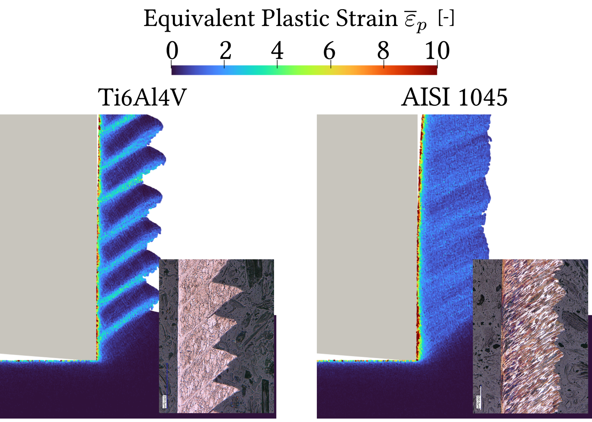

# SPH_FEM_2D_cutting_gpu

## This project is not available for public release.

## Description
- This project is an extension based on the previous SPH modeling of metal cutting process (Metal Cutting Simulations using Smoothed Particle Hydrodynamics on the GPU to published in the Journal of Advanced Manufacturing Technology (JAMT) by Röthlin et al.).
- The dependencies of the project include GLM and Gmsh.

- The hybrid model replaces the particle tool with finite element mesh based tool, which aims at improving the computational efficiency for high resolution cutting simulations.

## Features
- **GPU-Accelerated Computation**: Leverages CUDA to significantly speed up the simulation process, making it suitable for large-scale simulations.
- **Thermomechanical Analysis**: Provides the thermomechanical results including temperature, process forces, residual stresses and so on, which is critical for understanding the cutting process in metals.
- **Tool Wear Modeling**: Includes models for tool wear, offering insights into tool life and performance during cutting.
- **Flexible Input and Output**: Supports customizable input parameters for simulation scenarios and outputs data in formats compatible with visualization tools (e.g., VTK).

## Example

- **Temperature field in Ti6Al4V cutting**
 
 

- **Equivalent plastic strain in Ti6Al4V and AISI 1045 cutting compared with experimental results**
 
 

## Related publications
- [Hybrid SPH-FEM solver for metal cutting simulations on the GPU including thermal contact modeling](https://doi.org/10.1016/j.cirpj.2022.12.012), CIRP Journal of Manufacturing Science and Technology, Volume 41, April 2023, Pages 311-327 
- [Study on the effect of wear models in tool wear simulation using hybrid SPH-FEM method](https://doi.org/10.1016/j.procir.2023.03.070), Procedia CIRP, Volume 117, 2023, Pages 414-419

